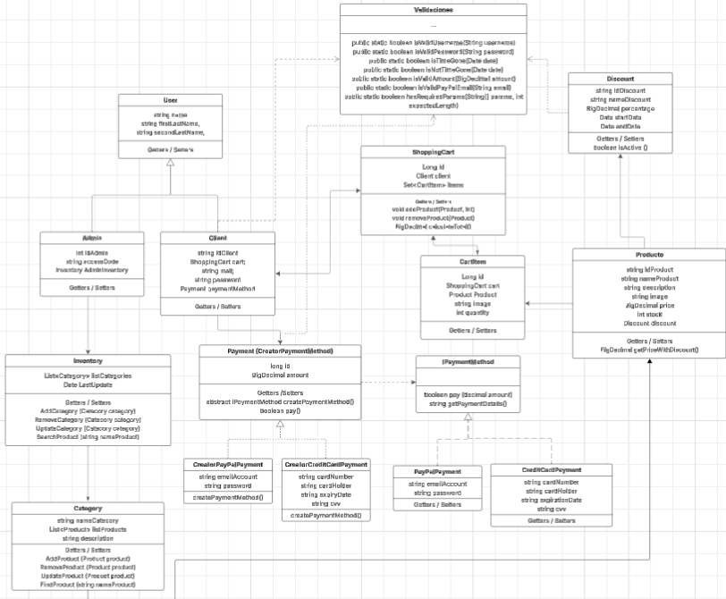

# OnlineBagsStore
Tienda Online de Carteras, mochilas
Base de datos: Mysql Workbench
Lenguaje: Java
Hecho en base de principios Solid

Contiene:

# Backend
*  User: Admin, Client
* ShoppingCart: CartItem
* Category
* Payment: CreatorPayPalPayment → PayPalPayment, CreatorCreditCardPayment → CreditCardPayment, IPaymentMethod, 
* Discount
* Inventory
* Product
* Validation
# Frontend 
* Login
* Product
* Cart
* Payment

# Base de Datos
 1. Login 

    INSERT INTO users (name, first_last_name, second_last_name)
    VALUES ('Vi', 'A', 'B');

    -- 2) Insertar en clients usando el mismo id generado en users
    INSERT INTO clients (id, id_client, email, password, payment_method_id)
    VALUES (LAST_INSERT_ID(), '2', 'vivi@gmail.com', '1234', NULL);

 2. Descuentos 

    ALTER TABLE cart_items ADD COLUMN coupon_code varchar(64) NULL;
    ALTER TABLE cart_items ADD COLUMN coupon_pct DECIMAL(5,2) NULL;

    UPDATE products
    SET discount_id = (SELECT id FROM discounts WHERE discount_code = '0000')
    WHERE id = 6;
3. Productos (falta especificar imagenes, nombre Bag-01)

   USE TiendaOnline;
   INSERT INTO tienda_online.products (id_product, name_product, description, price, stock, category_id, discount_id)
   VALUES
   ('BAG001', 'Mochila Urbana Negra', 'Mochila resistente al agua con múltiples compartimentos', 220.50, 15, 1, NULL),
   ('BAG002', 'Bolso Tote Colorido', 'Bolso tote grande con diseño colorido ideal para el día a día', 180.00, 20, 1, NULL),
   ('BAG003', 'Mochila Escolar Azul', 'Mochila ergonómica con compartimiento para laptop', 200.00, 10, 1, NULL),
   ('BAG004', 'Bolso de Mano Elegante', 'Bolso compacto para ocasiones especiales, material sintético', 250.00, 8, 1, NULL),
   ('BAG005', 'Mochila Deportiva Roja', 'Ideal para gimnasio y salidas, con bolsillos exteriores', 195.75, 12, 1, NULL);

    ALTER TABLE tienda_online.products ADD COLUMN image_url VARCHAR(255);

4. Categorias

   INSERT INTO tienda_online.categories (name_category, description, inventory_id)
   VALUES
   ('Bolsos de mano', 'Bolsos elegantes y compactos para ocasiones formales', NULL),
   ('Mochilas', 'Mochilas escolares, deportivas y urbanas', NULL),
   ('Totebags', 'Bolsas de tela grandes y reutilizables con estilo', NULL);